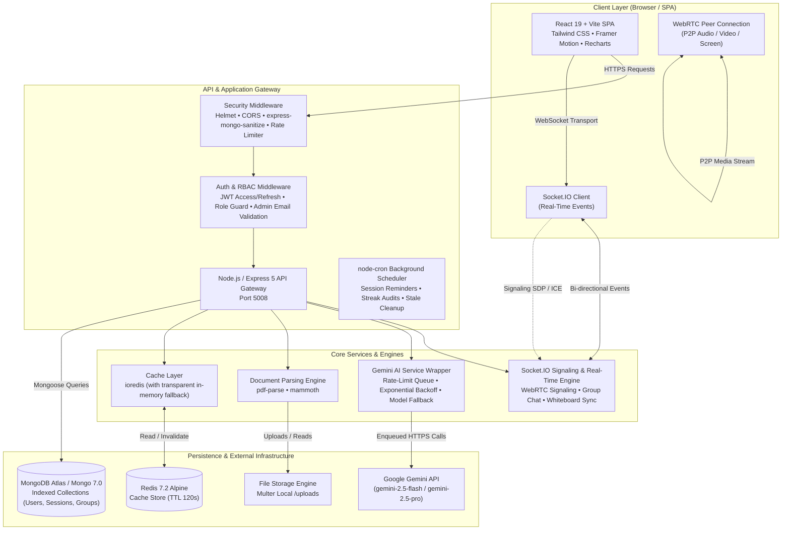
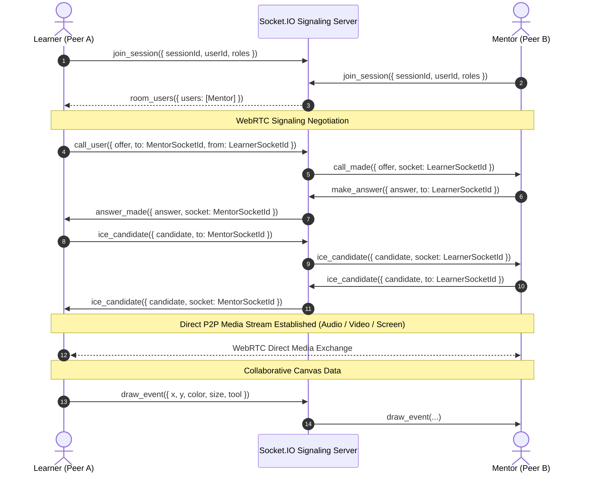
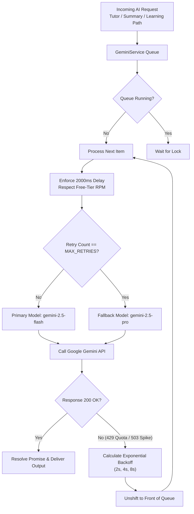
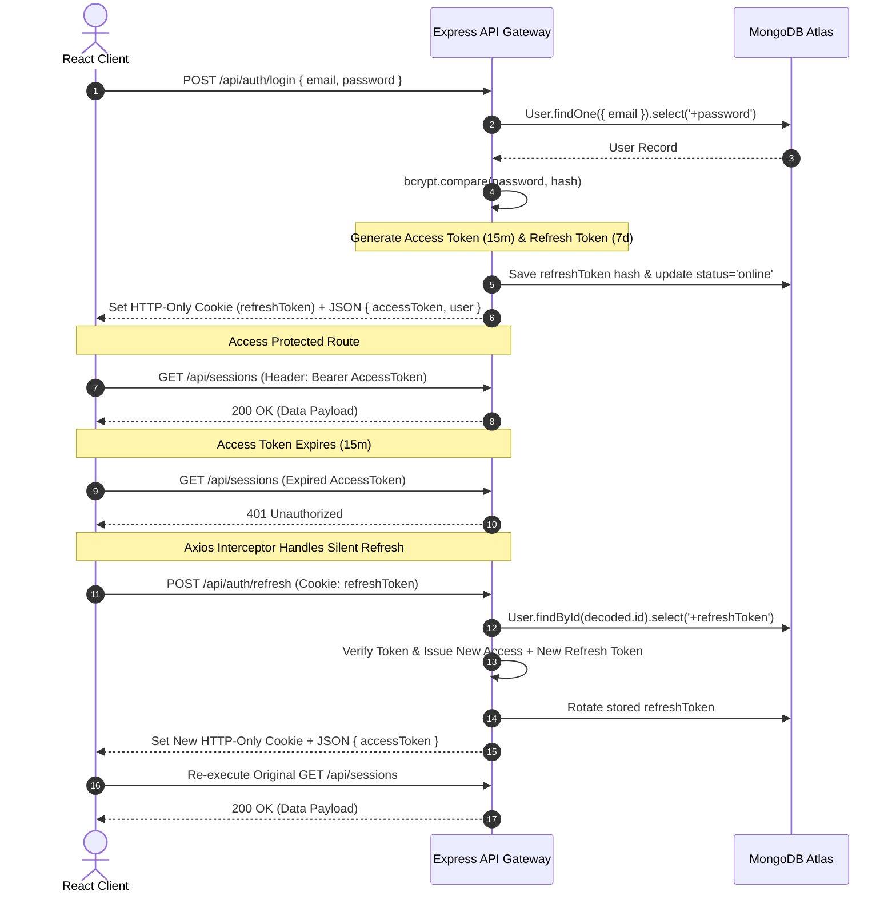

# SkillXchange

> A full-stack, peer-to-peer real-time skill-sharing and interactive mentorship platform featuring WebRTC video calling, collaborative canvas whiteboard, AI-powered tutoring with document analysis, dynamic learning roadmaps, peer study groups, and gamified reputation tracking.

[](https://skillxchange-cp.vercel.app/)
[](https://github.com/cherukuriyogini/SKILLXCHANGE-CP)

---

[](https://github.com/cherukuriyogini/SKILLXCHANGE-CP/actions)
[](https://react.dev/)
[](https://vitejs.dev/)
[](https://nodejs.org/)
[](https://expressjs.com/)
[](https://www.mongodb.com/)
[](https://socket.io/)
[](https://webrtc.org/)
[](https://ai.google.dev/)
[](https://redis.io/)
[](https://www.docker.com/)
[](https://tailwindcss.com/)

---

## Table of Contents

- [Overview](#overview)
  - [The Problem](#the-problem)
  - [The Solution](#the-solution)
- [Key Features](#key-features)
  - [1. Authentication & Dual-Role Context](#1-authentication--dual-role-context)
  - [2. Intelligent Skill Discovery & Matching](#2-intelligent-skill-discovery--matching)
  - [3. Live Interactive Sessions (WebRTC + Canvas)](#3-live-interactive-sessions-webrtc--canvas)
  - [4. AI-Powered Learning Suite (Google Gemini)](#4-ai-powered-learning-suite-google-gemini)
  - [5. Collaborative Peer Study Groups](#5-collaborative-peer-study-groups)
  - [6. Gamification, Streaks & Visual Analytics](#6-gamification-streaks--visual-analytics)
  - [7. Moderation, Support & Admin Suite](#7-moderation-support--admin-suite)
- [System Architecture](#system-architecture)
  - [High-Level Architecture](#high-level-architecture)
  - [WebRTC P2P Signaling Flow](#webrtc-p2p-signaling-flow)
  - [Resilient AI Queue & Failover Flow](#resilient-ai-queue--failover-flow)
  - [JWT Dual-Token Rotation Flow](#jwt-dual-token-rotation-flow)
- [Tech Stack](#tech-stack)
- [Database Schema & Data Models](#database-schema--data-models)
- [API Reference](#api-reference)
- [Automated Background Cron Jobs](#automated-background-cron-jobs)
- [Security & Reliability Engineering](#security--reliability-engineering)
- [Getting Started](#getting-started)
  - [Prerequisites](#prerequisites)
  - [Local Installation](#local-installation)
  - [Environment Variables Configuration](#environment-variables-configuration)
  - [Database Seeding](#database-seeding)
  - [Running with Docker Compose](#running-with-docker-compose)
- [Testing & Quality Assurance](#testing--quality-assurance)
- [CI/CD Workflow](#cicd-workflow)
- [License & Authors](#license--authors)

---

## Overview

**SkillXchange** is a production-grade full-stack platform designed to facilitate reciprocal peer-to-peer learning and mentorship without monetary friction. By pairing real-time interactive communication tools with generative AI assistance, SkillXchange provides a structured, engaging environment where any user can act as both a mentor for skills they have mastered and a learner for skills they want to acquire.

### The Problem
- **Passive Learning Fatigue:** Traditional MOOCs suffer from sub-10% completion rates due to pre-recorded videos, lack of real-time accountability, and zero interactive doubt resolution.
- **High Tutoring Paywalls:** One-on-one expert mentorship platforms charge prohibitive hourly rates, excluding students and early-career developers.
- **Disjointed Tooling:** Learners must jump across multiple siloed tools (Zoom/Google Meet for video, Miro for whiteboarding, ChatGPT for doubt-solving, and Google Calendar for scheduling).

### The Solution
SkillXchange unifies the entire learning lifecycle into a single web application:
1. **Reciprocal Skill Swapping:** Users register skills they teach (`skillsTeach`) and skills they want to learn (`skillsLearn`), enabling bidirectional discovery.
2. **Built-in Interactive Virtual Classrooms:** Low-latency WebRTC peer-to-peer video streaming, real-time shared HTML5 canvas whiteboard, in-call chat, and reaction triggers powered by WebSockets.
3. **24/7 AI Mentorship Overlay:** Google Gemini 2.5 integration for instant document Q&A (PDF/DOCX extraction), automatic post-session note synthesis, and structured milestone roadmap generation.
4. **Accountability & Gamification:** XP progression, level milestones, automated daily streak audits, peer study groups, and community reputation scoring.

---

## Key Features

### 1. Authentication & Dual-Role Context
- **Dual Role Switching:** Users can hold both `learner` and `mentor` roles concurrently on a single account, dynamically switching workspaces via a dedicated role-selection portal.
- **JWT Token Rotation:** Employs a short-lived Access Token (15m in memory/headers) alongside a cryptographically secure HTTP-only Refresh Token (7d in secure cookies) with automatic rotation.
- **Account Lockout & Protection:** Implements failed-attempt tracking (`loginAttempts >= 5` triggers a 30-minute lockout window) and password hashing with `bcryptjs` (salt rounds = 10).
- **Session Verification & Password Reset:** Tokenized email verification and SHA-256 hashed password reset tokens with 10-minute expiry windows.

### 2. Intelligent Skill Discovery & Matching
- **Compatibility Discovery:** Matches learners to prospective mentors by querying indexed overlapping skill arrays (`skillsTeach` vs `skillsLearn`).
- **Presence & Reputation Signals:** Real-time online/offline presence indicators, verified skill badges, total sessions completed, and dynamic average star ratings.
- **Direct Session Booking:** Request 30-, 60-, or 90-minute 1-on-1 sessions with custom agenda topics and scheduled timestamps.

### 3. Live Interactive Sessions (WebRTC + Canvas)
- **Peer-to-Peer WebRTC Calling:** Direct mesh peer-to-peer video and audio calling using `simple-peer` and Socket.IO signaling (`offer`, `answer`, `ice_candidate`).
- **Collaborative Canvas Whiteboard:** Real-time synchronized drawing surface with custom tool palette (brush colors, stroke width, pen, eraser, and full-canvas clear events).
- **Session Controls & Screen Sharing:** Integrated microphone toggling, camera stream switching, native display capture screen-sharing, and host-driven participant muting.
- **Interactive Chat & Emoji Reactions:** In-session ephemeral and persisted chat history (`SessionChat`), live emoji burst reactions, and automated post-session rating modals.

### 4. AI-Powered Learning Suite (Google Gemini)
- **Conversational AI Tutor:** Interactive chat with persistent history (`ChatMessage`) providing targeted explanations, code debugging, and concept breakdowns.
- **Document Q&A (`pdf-parse` & `mammoth`):** Upload PDF text documents or DOCX files; server extracts raw text and passes full context to Gemini for document-grounded question answering.
- **Automated Post-Session Summaries:** Gemini analyzes session topics and chat transcripts to produce structured markdown notes (executive summary, key takeaways, and action items), exportable to plain text or printable formats.
- **Milestone-Based Learning Paths:** Generates multi-week step-by-step roadmaps (`LearningPath`) with week-by-week goals, core topics, and recommended project milestones.
- **Ambient Floating AI Widget:** Global draggable AI doubt-solver overlay available across all authenticated dashboard views.

### 5. Collaborative Peer Study Groups
- **Skill-Based Group Rooms:** Create and join public study rooms organized by topic and proficiency levels (`beginner`, `intermediate`, `advanced`).
- **Real-Time Group Messaging:** WebSocket-broadcasted study room conversations with persistent message storage and member role management (`admin`, `member`).

### 6. Gamification, Streaks & Visual Analytics
- **Experience Points (XP) & Levels:** Earn XP upon session completion, AI milestone achievement, and peer feedback to progress through dynamic leveling tiers.
- **Daily Streak Tracking:** Daily login streak counters audited automatically at midnight via background cron jobs to encourage learning consistency.
- **Visual Performance Analytics:** Interactive dashboards powered by `Recharts` displaying mentor earnings, session completion volume, monthly learner reach, and rating distributions.

### 7. Moderation, Support & Admin Suite
- **Platform Health & Metrics:** Admin overview showing user growth trends, active session counts, role distribution ratios, and AI feature utilization metrics.
- **User Moderation & Account Suspension:** Tools to flag suspicious profiles, inspect reported interactions, and immediately block malicious users with socket-driven forced logouts.
- **Support Ticket Queue:** End-to-end ticketing system (`Ticket`) allowing users to submit bug reports and queries with priority levels (`low`, `medium`, `high`, `urgent`) and resolution states.

---

## System Architecture

### High-Level Architecture



---

### WebRTC P2P Signaling Flow



---

### Resilient AI Queue & Failover Flow



---

### JWT Dual-Token Rotation Flow



---

## Tech Stack

| Layer | Technology | Version | Purpose in SkillXchange |
|---|---|---|---|
| **Frontend Framework** | React | `^19.2.5` | Component-driven UI architecture with hooks and concurrent features |
| **Build Tool** | Vite | `^8.0.10` | Fast HMR development server and optimized Rollup production bundling |
| **Routing** | React Router DOM | `^7.14.2` | Client-side routing, protected role-based route wrappers, navigation guards |
| **Styling & UI** | Tailwind CSS | `^3.4.17` | Utility-first responsive design, modern dark/light card aesthetics |
| **Animations** | Framer Motion | `^12.38.0` | Fluid page transitions, modal spring physics, role-selection micro-interactions |
| **Data Visualization** | Recharts | `^3.8.1` | Responsive mentor analytics, session completion trends, earnings charts |
| **Icons** | Lucide React | `^1.14.0` | Crisp, accessible SVG iconography across all dashboards |
| **Real-Time Client** | Socket.IO Client | `^4.8.3` | WebSocket communication for chat, whiteboard sync, and WebRTC signaling |
| **WebRTC Client** | Simple-Peer | `^9.11.1` | WebRTC wrapper for managing peer connections, streams, and ICE candidates |
| **Document Export** | jsPDF / html2canvas | `^4.2.1 / ^1.4.1` | Client-side conversion of session notes and roadmaps into downloadable PDFs |
| **Markdown Rendering** | React Markdown / Remark | `^10.1.0 / ^4.0.1` | High-fidelity rendering of AI tutor responses with syntax highlighting |
| **Backend Runtime** | Node.js | `>=20.0.0` | High-performance asynchronous JavaScript server runtime |
| **Web Framework** | Express.js | `^5.2.1` | REST API routing, custom middleware pipelines, and controller architecture |
| **Database & ODM** | MongoDB / Mongoose | `7.0 / ^9.6.1` | Document database with strongly typed schemas, indexing, and pre-save hooks |
| **In-Memory Cache** | Redis / ioredis | `7.2 / ^6.0.0` | Low-latency response caching with automatic fallback when Redis is absent |
| **Real-Time Server** | Socket.IO | `^4.8.3` | Event-driven WebSocket server for rooms, presence, chat, and whiteboard |
| **AI Integration** | Google Generative AI SDK | `^0.24.1` | Gemini 2.5 Flash / Pro integration for AI tutoring and summary generation |
| **Document Parsing** | pdf-parse / mammoth | `^2.4.5 / ^1.12.0` | Server-side text extraction from uploaded PDF and Microsoft Word DOCX files |
| **Job Scheduling** | node-cron | `^4.6.0` | Automated cron tasks for session reminders, streak audits, and cleanup |
| **File Handling** | Multer | `^2.1.1` | Multipart form-data handling for user avatars and document uploads |
| **Security Suite** | Helmet / Mongo Sanitize | `^8.1.0 / ^2.2.0` | HTTP security headers, NoSQL query sanitization, and XSS string escaping |
| **Rate Limiting** | express-rate-limit | `^8.4.1` | API abuse prevention with environment-aware window quotas |
| **Authentication** | jsonwebtoken / bcryptjs | `^9.0.3 / ^3.0.3` | Signed JWT access/refresh tokens and one-way cryptographic password hashing |
| **Containerization** | Docker & Docker Compose | `v3.9 Compose` | Multi-container orchestration (MongoDB, Redis, Node Backend, Nginx Frontend) |
| **CI/CD** | GitHub Actions | `v4` | Automated linting, syntax verification, and frontend production build pipeline |

---

## Database Schema & Data Models

The MongoDB database contains 9 primary collections:

| Collection | Model File | Description & Key Indexes |
|---|---|---|
| `users` | [`backend/models/User.js`](backend/models/User.js) | Stores credentials, profile data, roles (`learner`, `mentor`, `moderator`, `admin`), skills arrays, XP, level, daily streaks, reputation score, and lockout metadata. Index: `email` (unique), `roles`, `skillsTeach`, `skillsLearn`. |
| `sessions` | [`backend/models/Session.js`](backend/models/Session.js) | Manages 1-on-1 mentorship bookings, scheduled timestamps, status (`requested`, `accepted`, `completed`, `cancelled`, `ai-substitute`), reschedule proposals, ratings, and AI summaries. Index: `sessionId` (unique), `mentorId`, `learnerId`. |
| `peergroups` | [`backend/models/PeerGroup.js`](backend/models/PeerGroup.js) | Study groups categorized by skill and proficiency (`beginner`, `intermediate`, `advanced`), tracking member lists, member roles, and active discussions. |
| `learningpaths` | [`backend/models/LearningPath.js`](backend/models/LearningPath.js) | AI-generated milestone learning roadmaps for users, with step-by-step topics, completion tracking, and estimated completion duration. |
| `chatmessages` | [`backend/models/ChatMessage.js`](backend/models/ChatMessage.js) | Persistent conversation history between users and the AI Tutor, storing role messages (`user`, `assistant`) and uploaded document metadata. |
| `sessionchats` | [`backend/models/SessionChat.js`](backend/models/SessionChat.js) | Persistent in-meeting text messages sent during live WebRTC sessions for auditability and summary generation. |
| `notifications` | [`backend/models/Notification.js`](backend/models/Notification.js) | In-app alerts for session booking requests, mentor acceptance, cancellations, and automated 30-minute reminder broadcasts. |
| `reports` | [`backend/models/Report.js`](backend/models/Report.js) | User-submitted violation reports against abusive behavior or inappropriate content, managed by moderators and admins. |
| `tickets` | [`backend/models/Ticket.js`](backend/models/Ticket.js) | User support tickets with categorized issue types, status flags (`open`, `in-progress`, `resolved`), and priority levels. |

---

## API Reference

The backend exposes a structured REST API under the `/api` prefix:

### Authentication (`/api/auth`)
| Method | Endpoint | Access | Description |
|---|---|---|---|
| `POST` | `/api/auth/signup` | Public | Register new user with skills and roles |
| `POST` | `/api/auth/login` | Public | Authenticate user, issue access token & refresh cookie |
| `POST` | `/api/auth/refresh` | Public | Rotate refresh token and issue new access token |
| `POST` | `/api/auth/logout` | Private | Clear refresh token cookie and set status to offline |
| `GET` | `/api/auth/me` | Private | Retrieve authenticated user profile and roles |
| `POST` | `/api/auth/forgot-password`| Public | Generate and dispatch password reset token |
| `PUT` | `/api/auth/reset-password/:token`| Public | Reset password using valid cryptographic token |

### User Management (`/api/users`)
| Method | Endpoint | Access | Description |
|---|---|---|---|
| `GET` | `/api/users/profile` | Private | Retrieve current user profile with gamification stats |
| `PUT` | `/api/users/profile` | Private | Update bio, teaching skills, and learning goals |
| `POST` | `/api/users/avatar` | Private | Upload profile picture via Multer |
| `GET` | `/api/users/mentors` | Public | Search and discover mentors filtered by skill |
| `GET` | `/api/users/leaderboard` | Public | Get top users ranked by reputation score and XP |

### Live Sessions (`/api/sessions`)
| Method | Endpoint | Access | Description |
|---|---|---|---|
| `POST` | `/api/sessions/request` | Private (Learner) | Book a new mentorship session |
| `GET` | `/api/sessions/my-sessions` | Private | Retrieve all sessions for current user |
| `PUT` | `/api/sessions/:id/accept` | Private (Mentor) | Accept a pending session request |
| `PUT` | `/api/sessions/:id/cancel` | Private | Cancel a session with custom reason |
| `PUT` | `/api/sessions/:id/reschedule`| Private | Propose a new scheduled time |
| `PUT` | `/api/sessions/:id/rate` | Private (Learner) | Submit 1–5 star rating and feedback review |

### AI Services (`/api/ai`)
| Method | Endpoint | Access | Description |
|---|---|---|---|
| `POST` | `/api/ai/tutor-chat` | Private | Send query to Gemini AI tutor with context |
| `POST` | `/api/ai/document-qa` | Private | Upload PDF/DOCX document and ask targeted questions |
| `POST` | `/api/ai/generate-summary`| Private | Generate structured notes from session history |
| `GET` | `/api/ai/session-summary/:id/download` | Private | Export session summary as formatted text file |

### Learning Paths & Peer Groups (`/api/learning-path`, `/api/peer-groups`)
| Method | Endpoint | Access | Description |
|---|---|---|---|
| `POST` | `/api/learning-path/generate` | Private | Generate AI milestone learning roadmap |
| `GET` | `/api/learning-path/my-paths` | Private | Retrieve saved learning roadmaps |
| `GET` | `/api/peer-groups` | Public | List available skill-based study groups |
| `POST` | `/api/peer-groups` | Private | Create a new peer study group |
| `POST` | `/api/peer-groups/:id/join` | Private | Join an existing study group |

### Administration & Moderation (`/api/admin`, `/api/reports`, `/api/tickets`)
| Method | Endpoint | Access | Description |
|---|---|---|---|
| `GET` | `/api/admin/stats` | Admin | Comprehensive platform usage & growth metrics |
| `GET` | `/api/admin/users` | Admin | Search, filter, and inspect all registered accounts |
| `PUT` | `/api/admin/users/:id/block` | Admin | Toggle user block status and terminate sessions |
| `POST` | `/api/reports` | Private | Submit content or user violation report |
| `GET` | `/api/reports` | Moderator / Admin | Inspect pending moderation report queue |
| `POST` | `/api/tickets` | Private | Submit support assistance ticket |

---

## Automated Background Cron Jobs

The backend includes automated background workers powered by `node-cron` in [`backend/jobs/scheduler.js`](backend/jobs/scheduler.js):

```
┌─────────────────────────┬──────────────┬────────────────────────────────────────────────────────┐
│ Job Name                │ Cron Pattern │ Purpose & Execution Details                            │
├─────────────────────────┼──────────────┼────────────────────────────────────────────────────────┤
│ 1. Session Reminders    │ * * * * *    │ Runs every minute. Queries sessions starting in ~30    │
│                         │ (Every min)  │ mins, pushes in-app notifications and WebSocket alerts │
├─────────────────────────┼──────────────┼────────────────────────────────────────────────────────┤
│ 2. Daily Streak Audit   │ 5 0 * * *    │ Runs daily at 00:05. Verifies user activity within the │
│                         │ (Midnight)   │ last 24–48 hours; resets streak to 0 if inactive.      │
├─────────────────────────┼──────────────┼────────────────────────────────────────────────────────┤
│ 3. Stale Cleanup        │ 0 * * * *    │ Runs hourly. Auto-cancels unaccepted session requests  │
│                         │ (Hourly)     │ whose scheduled time has elapsed.                      │
└─────────────────────────┴──────────────┴────────────────────────────────────────────────────────┘
```

---

## Security & Reliability Engineering

- **Express 5 Safe Sanitization:** Custom input sanitization layer combining `express-mongo-sanitize` (adapted to avoid reassigning Express 5's `req.query` getter) and `validator.js` HTML escaping to prevent NoSQL injections and cross-site scripting (XSS).
- **Graceful Redis Degradation:** If Redis is down or unreachable in development/production, the application logs a single diagnostic warning and transparently falls back to direct database execution with zero service interruption.
- **Fail-Safe AI Rate Limiter:** Custom promise-based queue serializes Gemini requests with a 2-second rate-limiting threshold, exponential backoff (2s, 4s, 8s) on HTTP 429/503 responses, and automatic failover from `gemini-2.5-flash` to `gemini-2.5-pro`.
- **Strict Admin Authorization:** Enforces environment-variable-backed email checks (`ADMIN_EMAIL`) alongside cryptographic role verification to eliminate unauthorized privilege escalation.
- **Strict CORS & Security Headers:** Integrated `helmet` policy with `crossOriginResourcePolicy` and dynamic CORS whitelisting that normalizes trailing slashes and handles local/production origins cleanly.

---

## Getting Started

### Prerequisites

Make sure you have the following installed on your machine:
- **Node.js**: `>= 20.0.0`
- **npm**: `>= 9.0.0`
- **MongoDB**: Local MongoDB instance (`v7.0+`) or a free [MongoDB Atlas](https://cloud.mongodb.com) cluster
- **Redis (Optional)**: Local Redis server (`v7.2+`) or cloud instance (app gracefully falls back if absent)
- **Google Gemini API Key**: Free API key from [Google AI Studio](https://aistudio.google.com/)

---

### Local Installation

1. **Clone the repository:**
   ```bash
   git clone https://github.com/cherukuriyogini/SKILLXCHANGE-CP.git
   cd SKILLXCHANGE-CP
   ```

2. **Install all dependencies (Root, Backend, and Frontend):**
   ```bash
   npm run install:all
   ```

3. **Configure Environment Variables:**
   Create `.env` files in both the `backend/` and `frontend/` directories using the reference templates below.

---

### Environment Variables Configuration

#### Backend Configuration: `backend/.env`
```env
# Server Port & Mode
PORT=5008
NODE_ENV=development

# Database Connection (MongoDB Atlas or Local)
MONGO_URI=mongodb+srv://<username>:<password>@cluster.mongodb.net/?appName=SkillXchange

# Authentication Secrets (Generate using: node -e "console.log(require('crypto').randomBytes(64).toString('hex'))")
JWT_ACCESS_SECRET=your_64_byte_access_secret_key_here
JWT_REFRESH_SECRET=your_64_byte_refresh_secret_key_here
JWT_SECRET=your_64_byte_legacy_secret_key_here
COOKIE_SECRET=your_64_byte_cookie_secret_key_here

JWT_ACCESS_EXPIRE=15m
JWT_REFRESH_EXPIRE=7d
JWT_EXPIRE=7d

# Designated Admin Email for Superadmin Routes
ADMIN_EMAIL=admin@skillxchange.com

# Client URLs for CORS and WebSocket Whitelisting
CLIENT_URL=http://localhost:5173
FRONTEND_URL=http://localhost:5173

# Google Gemini API
GEMINI_API_KEY=your_gemini_api_key_from_google_ai_studio
GEMINI_MODEL=gemini-2.5-flash

# Redis Configuration (Optional - falls back to memory if empty)
REDIS_URL=redis://127.0.0.1:6379

# Cloudinary Storage (Optional for Cloud Avatars)
CLOUDINARY_CLOUD_NAME=
CLOUDINARY_API_KEY=
CLOUDINARY_API_SECRET=

# Email Transporter (Optional for Password Reset Emails)
EMAIL_USER=
EMAIL_PASS=
```

#### Frontend Configuration: `frontend/.env`
```env
VITE_API_URL=http://localhost:5008/api
VITE_SOCKET_URL=http://localhost:5008
```

---

### Database Seeding

Populate your database with demo users (Learner, Mentor, Moderator, Admin) and sample peer study groups:

```bash
# Safe Idempotent Seed (Inserts only if not present)
npm run seed --prefix backend

# Destructive Seed (Wipes and re-seeds clean development database)
npm run seed:force --prefix backend
```

**Default Demo Credentials:**
- **Learner:** `learner@skillxchange.com` / `password123`
- **Mentor:** `mentor@skillxchange.com` / `password123`
- **Moderator:** `moderator@skillxchange.com` / `password123`
- **Admin:** `admin@skillxchange.com` / `password123`

---

### Starting Development Servers

Run both Backend and Frontend concurrently from the root directory:

```bash
npm run dev
```

Or on Windows, launch both servers via the pre-configured launcher:
```cmd
.\start.bat
```

- **Frontend Application:** `http://localhost:5173`
- **Backend API:** `http://localhost:5008/api`
- **API Health Check:** `http://localhost:5008/api/health`

---

### Running with Docker Compose

To spin up the entire multi-container architecture (MongoDB, Redis, Backend, Frontend Nginx):

```bash
# Build and start all services
docker-compose up --build

# Run in detached mode
docker-compose up -d

# Stop all containers and preserve volumes
docker-compose down
```

---

## Testing & Quality Assurance

SkillXchange includes syntax validation, model connection tests, and automated build verification:

```bash
# Run backend model and Gemini AI service tests
npm test --prefix backend

# Validate backend JavaScript syntax across all files
find backend -name "*.js" -not -path "*/node_modules/*" -exec node --check {} \;

# Run ESLint on the frontend codebase
npm run lint --prefix frontend

# Verify production frontend build
npm run build --prefix frontend
```

---

## CI/CD Workflow

The repository includes an automated GitHub Actions pipeline ([`.github/workflows/ci.yml`](.github/workflows/ci.yml)) triggered on every push and pull request to `main`:

```
┌─────────────────────────────────────────────────────────────┐
│                   GitHub Actions CI Pipeline                │
├──────────────────────────────┬──────────────────────────────┤
│ 1. Environment Setup         │ Node.js 20.x on Ubuntu       │
│ 2. Dependency Audit          │ npm install across workspace │
│ 3. Static Code Analysis      │ ESLint rules verification    │
│ 4. Frontend Compilation      │ Vite production build check  │
│ 5. Backend Syntax Validation │ Node AST check on all files  │
└──────────────────────────────┴──────────────────────────────┘
```

---

## License & Authors

This project is licensed under the **ISC License**.

**Developed & Maintained by:**
- **Cherukuri Yogini** — [GitHub Profile](https://github.com/cherukuriyogini) • [Repository](https://github.com/cherukuriyogini/SKILLXCHANGE-CP)

---

<div align="center">
  <sub>Built with ❤️ for collaborative, accessible, and AI-augmented peer learning.</sub>
</div>
